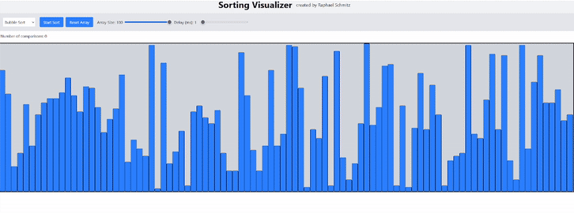
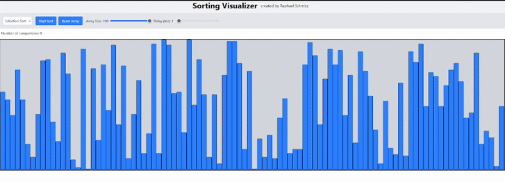
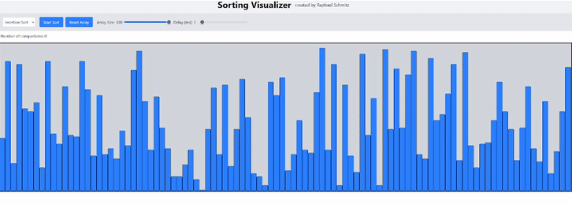
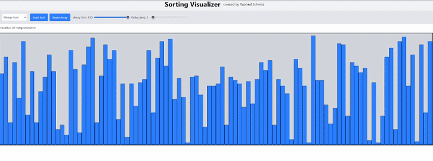
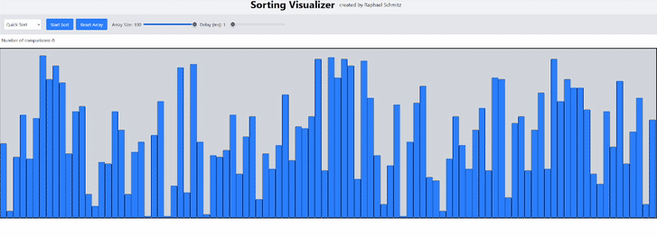
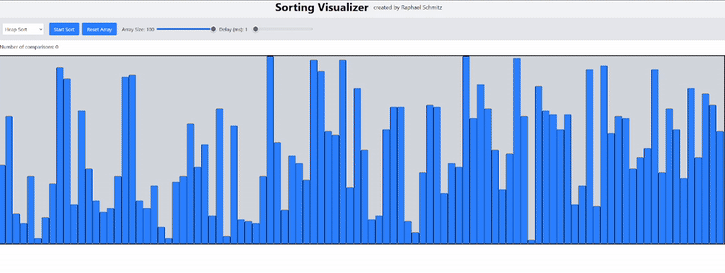

# Sorting Visualizer

A Next.js app showcasing animated visualizations of various sorting algorithms.
## Description

This project is a modern web app built with Next.js (bootstrapped using create-next-app), featuring animated, interactive visualizations of sorting algorithms. It's written in TypeScript and leverages dynamic user interaction and smooth animations.
Features

Visual representations of popular sorting algorithms (e.g., Bubble Sort, Quick Sort, Merge Sort, etc.)

Responsive and interactive UI built with modern web technologies

Real-time visualization of the algorithm’s operations

Polished styling using Next.js with optimized loading of the Geist font

## Setup & Installation

Clone the repo:

```
git clone https://github.com/schmitz-raphael/sorting_visualizer.git
cd sorting_visualizer
```
Install dependencies:
```
npm install
```


Start development server:
```
npm run dev
```

Navigate to http://localhost:3000 in your browser to view the app.

Alternatively, the site can also be accessed over https://schmitz-raphael.github.io/sorting_visualizer/ 


## Implemented Sorting algorithms

### Bubble Sort



### Selection Sort



### Insertion Sort



### Merge Sort



### Quick Sort



### Heap Sort




## Potential improvements

- Implement more sorting algorithms
- Refactor to improve maintanability
- Make a more appealing UI